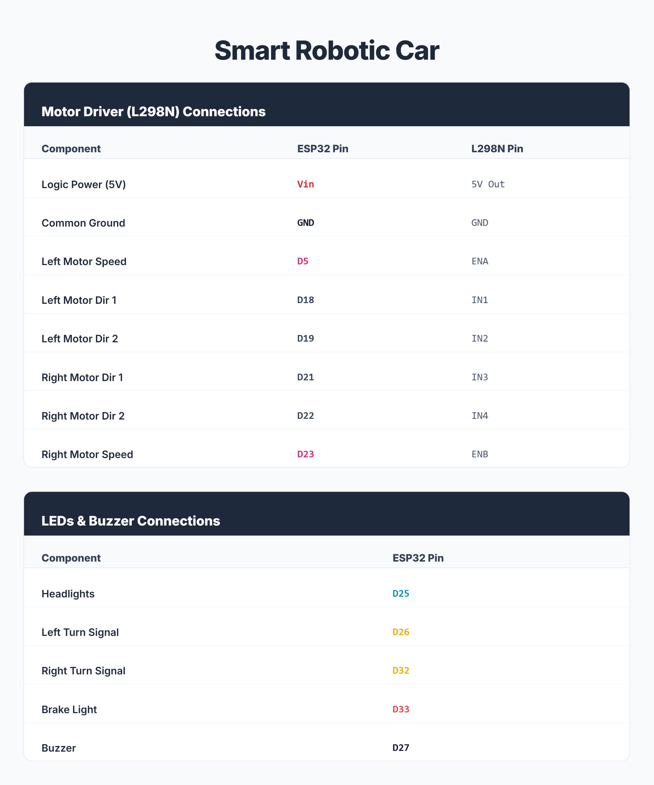

# Smart Robotic Car

<p align="center">
      
      
      
</p>

<p align="center"><strong>Build. Connect. Drive.</strong></p>

An ESP32-based robotic car with a real-time browser dashboard for smooth wireless control.
No app installation. No external router. Just power on and drive.

## Overview

- Creates its own Wi-Fi access point
- Works from any phone or desktop browser
- Supports directional driving and speed levels
- Includes lights, horn, and turn indicators

## Visuals



Demo video: [Video.mp4](Video.mp4)

## Hardware Stack

- ESP32 development board
- L298N motor driver
- DC motors and car chassis
- LEDs (headlight, brake/reverse, indicators)
- Active buzzer
- Battery source

## Quick Launch

1. Open Code/Smart_Robotic_Car.ino in Arduino IDE.
2. Select ESP32 board and COM port.
3. Complete wiring and confirm common ground.
4. Upload the sketch.
5. Connect to Wi-Fi:
       - SSID: Smart Robotic Car
       - Password: 12345678
6. Open http://192.168.4.1

## Project Structure

```text
Smart_Robotic_Car/
|-- README.md
|-- Diagram.png
|-- Video.mp4
`-- Code/
            `-- Smart_Robotic_Car.ino
```
